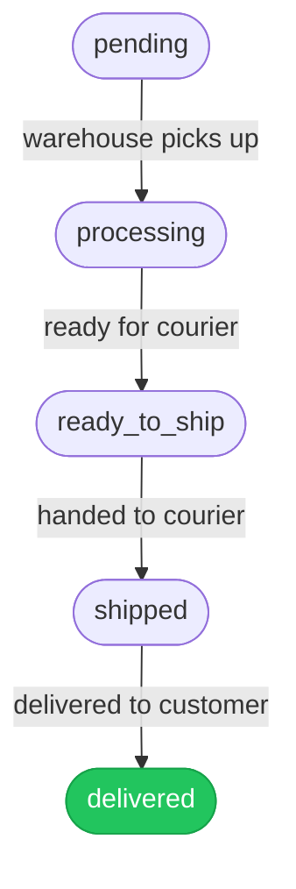
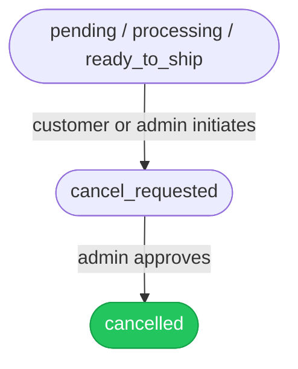
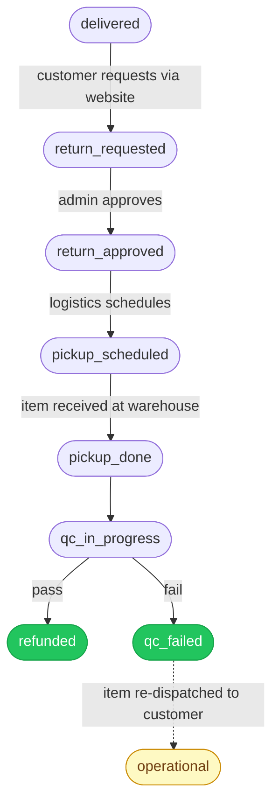
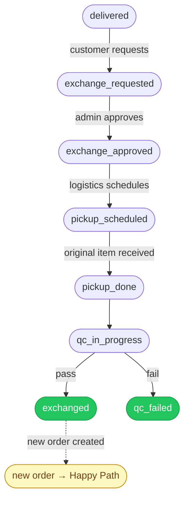
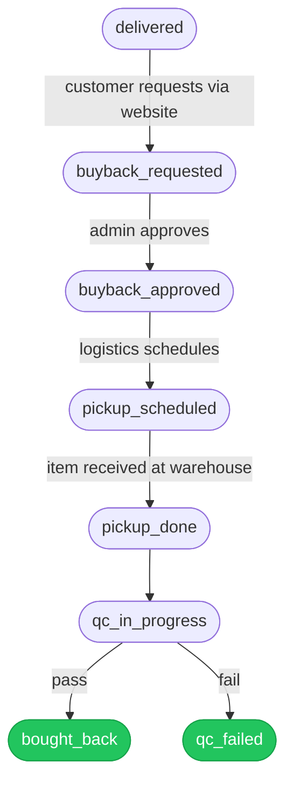

# Post-Order Management

Manages everything that happens after an order is placed — cancellations, returns, exchanges, and buybacks — each tracked through a defined set of statuses on the order's extended record.

Every order starts at `pending` and progresses forward. Status is stored on the **extended order**, not the core Medusa order, so we control all transitions ourselves.

---

## Order Status Categories

| Category           | Who sets it                                     | When                                  |
| ------------------ | ----------------------------------------------- | ------------------------------------- |
| **System-set**     | Warehouse / courier integrations                | Forward progress: pending → delivered |
| **Request-driven** | Workflow, triggered by customer or admin action | On request create or approve          |
| **Post-request**   | Workflow, triggered during physical processing  | Pickup, QC, refund, completion        |

---

## The Happy Path

All orders begin here. Status advances as the warehouse and courier report progress.

Once `delivered`, the order is open for post-order actions (return, exchange, buyback). Admin cannot manually set `pending` through `delivered` — these are system-only.

---

## Cancellation

Customers or admins can cancel before the order reaches the courier. Once `shipped`, cancellation is no longer possible — any resolution must go through the return flow after delivery.

**No physical pickup is needed** — the item hasn't left the warehouse, so the flow ends at `cancelled` with no QC step.

---

## Return

Customer initiates a return via the website after receiving their order. We approve it, schedule a pickup, and run a quality check before issuing a refund.

If QC fails, we do not deduct any amount — the return is rejected cleanly and the item is sent back. No partial refunds.

> ⚠️ Customer-facing `return_requested` requires a store endpoint — not yet implemented.

---

## Exchange

Customer wants a different variant or item. We pick up the original, run QC, and only create the replacement order if the item passes inspection. This prevents dispatching a replacement for a damaged or tampered item.

The original order ends at `exchanged`. The new replacement order is a fully independent order with its own lifecycle starting at `pending`.

---

## Buyback

The customer initiates a buyback request via the website, and we run the same pickup-and-QC loop as a return. Since this is a merchant purchase, not a refund, the terminal status is `bought_back` rather than `refunded`.

---

## Terminal States

Once an order reaches a terminal state, no further transitions are possible.

| Flow               | Terminal Status | Meaning                                   |
| ------------------ | --------------- | ----------------------------------------- |
| Normal delivery    | `delivered`     | Order fulfilled successfully              |
| Cancellation       | `cancelled`     | Cancelled before dispatch                 |
| Return — QC pass   | `refunded`      | Item returned, refund issued              |
| Return — QC fail   | `qc_failed`     | Return rejected, item sent back           |
| Exchange — QC pass | `exchanged`     | Original returned, replacement dispatched |
| Exchange — QC fail | `qc_failed`     | Exchange rejected, no replacement         |
| Buyback — QC pass  | `bought_back`   | Merchant purchased item                   |
| Buyback — QC fail  | `qc_failed`     | Buyback rejected                          |

---

## What Admin Can and Cannot Do

Admin controls the **approval step** in every post-order flow. They cannot move an order backwards or skip statuses.

| Admin can set                              | Admin cannot set                         |
| ------------------------------------------ | ---------------------------------------- |
| `cancel_requested`, `cancelled`            | `pending`, `processing`, `ready_to_ship` |
| `return_requested`, `return_approved`      | `shipped`, `delivered`                   |
| `exchange_requested`, `exchange_approved`  | Any terminal state from another terminal |
| `buyback_requested`, `buyback_approved`    |                                          |
| `pickup_scheduled`, `pickup_done`          |                                          |
| `qc_in_progress`, `qc_passed`, `qc_failed` |                                          |
| `refunded`, `exchanged`, `bought_back`     |                                          |

The system-set statuses (`pending` → `delivered`) are driven exclusively by warehouse and courier integrations.

---

## Edge Cases

- **Shipped order, undelivered** — if a courier returns an undelivered package, there is no backward transition to handle it. Currently treated as a warehouse exception outside the status system.
- **QC failed on exchange** — the replacement order must be manually cancelled by admin; there is no automatic link between the original order's `qc_failed` and the new order's cancellation.
- **`qc_failed` re-dispatch** — when a return or buyback fails QC, the item is re-dispatched to the customer. This dispatch is outside the order status system and handled operationally.
