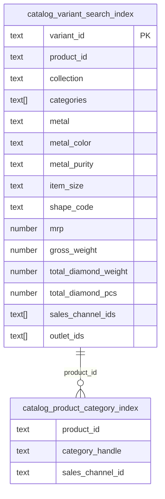
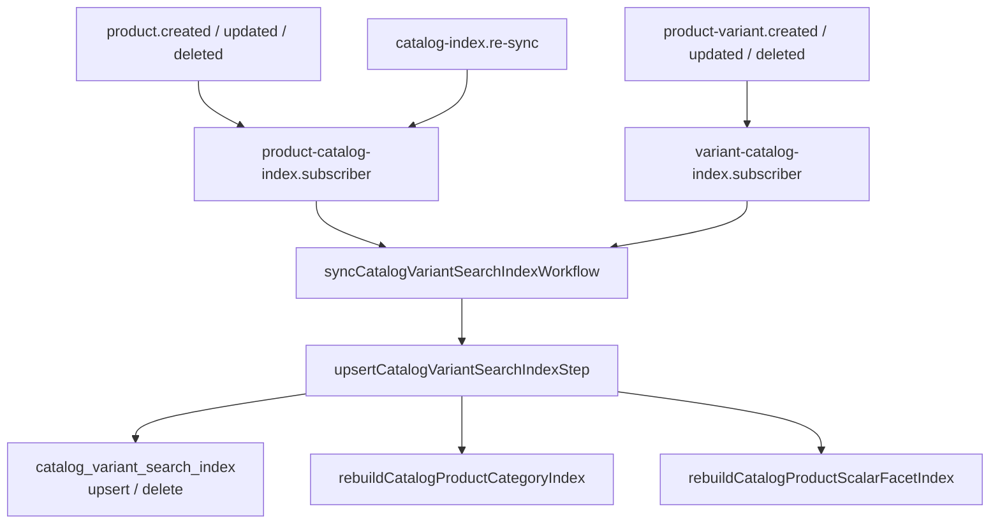

## Overview

The `catalog-variant-search-index` module provides PostgreSQL-based search, filtering, and faceted aggregations for product variants. It replaces OpenSearch with three synchronized tables that are kept in sync via Medusa event subscribers.

---

## Architecture

### Tables

| Table                                | Purpose                                                                                                 |
| ------------------------------------ | ------------------------------------------------------------------------------------------------------- |
| `catalog_variant_search_index`       | Main variant search with all filterable fields, facets, and range data                                  |
| `catalog_product_category_index`     | Product↔category mapping (used for category-level queries)                                              |
| `catalog_product_scalar_facet_index` | Legacy product scalar facets — **not used for facet computation** (see [Scalar Facets](#scalar-facets)) |

### Table Relationships



---

## Sync Flow

### Event-Driven Architecture



---

## Subscribers

### 1. `product-catalog-index.subscriber.ts`

**Events:** `product.created`, `product.updated`, `product.deleted`, `catalog-index.re-sync`

| Event | Action |
|---|---|
| `product.created` | Fetch all variants → index each → rebuild category index |
| `product.updated` | Re-index all variants → rebuild category index |
| `product.deleted` | Delete all variant + category indexes for the product |
| `catalog-index.re-sync` | Delete all → re-fetch → re-index all variants |

**Manual re-sync:**
```typescript
const eventBus = container.resolve(Modules.EVENT_BUS);
await eventBus.emit({
name: "catalog-index.re-sync",
data: { product_id: "prod_01KDFN2C3YKDBW0KCKRBQVW1B1" },
});
````

**Logs:**

```
[product-catalog-index] Received event: catalog-index.re-sync
[product-catalog-index] Found 5 variants to re-index
[product-catalog-index] === Re-sync complete: 5 indexed, 0 skipped, 0 failed ===
```

---

### 2. `variant-catalog-index.subscriber.ts`

**Events:** `product-variant.created`, `product-variant.updated`, `product-variant.deleted`

| Event                     | Action                                  |
| ------------------------- | --------------------------------------- |
| `product-variant.created` | Index variant → rebuild category index  |
| `product-variant.updated` | Update variant → rebuild category index |
| `product-variant.deleted` | Delete variant → rebuild category index |

**Logs:**

```
[variant-catalog-index] Received event: product-variant.updated
[variant-catalog-index] Upserting variant index: variant_xxx (product: prod_xxx)
[variant-catalog-index] Successfully indexed variant: variant_xxx
```

---

## Service API

### `search(options)`

```typescript
const { items, count, facets } = await catalogService.search({
  filters: {
    status: "published",
    metal: "gold",
    mrp: { min: 10000, max: 50000 }, // single range
    gross_weight: [
      { min: 2, max: 4 },
      { min: 6, max: 8 },
    ], // multiple ranges (OR)
    categories: ["rings"],
    sales_channel_ids: ["sc_xxx"],
  },
  resultFilters: {
    outlet_ids: ["outlet_1"], // narrows results but NOT facets
  },
  pagination: { skip: 0, take: 20, order: { mrp: "asc" } },
  facets: ["metal", "metal_color", "item_size", "mrp", "gross_weight"],
  collapseByProduct: true, // DISTINCT ON product_id for PLP
});
```

**`filters` vs `resultFilters`:**

|                 | Affects results | Affects facet counts |
| --------------- | --------------- | -------------------- |
| `filters`       | ✅              | ✅                   |
| `resultFilters` | ✅              | ❌                   |

Use `resultFilters` only for outlet/is_default narrowing where you don't want facet counts to change.

### Index Management

```typescript
// Upsert variants (does NOT auto-rebuild product-level indexes)
await service.upsertCatalogVariantSearchIndices([variantDoc]);

// Delete by variant ID
await service.deleteCatalogVariantSearchIndexByVariantId(variantId);

// Delete by product ID (all 3 indexes)
await service.deleteCatalogVariantSearchIndicesByProductId(productId);

// Rebuild category index (call after all variants for a product are processed)
await service.rebuildCatalogProductCategoryIndex(productId);

// Rebuild scalar facet index
await service.rebuildCatalogProductScalarFacetIndex(productId);
```

> **Note:** Subscribers must call `rebuildCatalogProductCategoryIndex()` explicitly after processing all variants for a product to avoid race conditions.

---

## Facets

### Scalar Facets

Scalar facets (`metal`, `gender`, `metal_color`, `metal_purity`, `item_size`, `collection`, `categories`, `shape_code`) are computed **directly from `catalog_variant_search_index`** using a CTE + UNION ALL query. Each bucket shows `COUNT(DISTINCT product_id)`.

> The `catalog_product_scalar_facet_index` table exists but is **not used** for facet computation — scalar facets are computed at query time from the variant index to ensure accuracy with combined filters.

### Range Facets

Range facets (`mrp`, `gross_weight`, `total_diamond_weight`, `total_diamond_pcs`) use predefined buckets with **half-open intervals** `[from, to)`.

| Facet                  | Buckets                           |
| ---------------------- | --------------------------------- |
| `mrp`                  | 0–10K, 10K–25K, 25K–50K, ... 10L+ |
| `gross_weight`         | 0–2, 2–4, 4–6, 6–8, 8–10, 10+     |
| `total_diamond_weight` | 0–0.25, 0.25–0.5, ..., 5+         |
| `total_diamond_pcs`    | 0–2, 2–4, ..., 40+                |

**Multiple range selection** (OR) is supported — pass an array:

```
?price={"min":0,"max":10000},{"min":10000,"max":25000}
```

### Self-Excluding Facets

By default, when a filter is active its own facet is computed **without** that filter applied — so all buckets remain visible for navigation. Fields: `gender`, `metal`, `metal_color`, `metal_purity`, `item_size`, `collection`, `categories`, `mrp`, `gross_weight`, `total_diamond_weight`, `total_diamond_pcs`.

### Facet Labels (`normalizeV2Aggregations`)

Range facet labels returned to the API:

| Facet           | Example labels                       |
| --------------- | ------------------------------------ |
| `price`         | `Under ₹10K`, `₹10K – ₹25K`, `₹10L+` |
| `weight_ranges` | `0–2g`, `2–4g`, `10g+`               |
| `diamond_piece` | `0–2 pcs`, `2–4 pcs`, `40+ pcs`      |
| `diamond_carat` | `0–0.25 ct`, `0.25–0.5 ct`, `5+ ct`  |

---

## API: `GET /store/extended-variant`

### Key Query Params

| Param                                  | Type                                        | Description                                  |
| -------------------------------------- | ------------------------------------------- | -------------------------------------------- |
| `q`                                    | string                                      | Full-text search                             |
| `categories`                           | string                                      | Comma-separated category handles             |
| `collection`                           | string                                      | Collection handle                            |
| `metal`, `metal_color`, `metal_purity` | string                                      | Comma-separated scalar filters               |
| `item_size` / `size`                   | string                                      | Size filter                                  |
| `shape_code` / `diamond_shape`         | string                                      | Diamond shape                                |
| `price`                                | string                                      | JSON range(s): `{"min":0,"max":10000}`       |
| `weight_ranges`                        | string                                      | JSON range(s): `{"min":2,"max":6}`           |
| `diamond_carat`                        | string                                      | JSON range(s)                                |
| `diamond_piece`                        | string                                      | JSON range(s)                                |
| `mrp_min` / `mrp_max`                  | string                                      | Flat price range params                      |
| `fast_delivery`                        | `"true"`                                    | Filter to in-stock only                      |
| `sort`                                 | `price_asc\|price_desc\|weight_asc\|latest` | Sort order                                   |
| `page`                                 | `"categories"\|"collection"`                | Excludes that facet from aggregations        |
| `outlet_id`                            | string                                      | Outlet filter (result-only, no facet impact) |
| `offset` / `limit`                     | string                                      | Pagination                                   |

**`page` param behavior:**

| `page`       | Effect                                                           |
| ------------ | ---------------------------------------------------------------- |
| `categories` | Removes `categories` from aggregations (use on category pages)   |
| `collection` | Removes `collection` from aggregations (use on collection pages) |
| _(omitted)_  | All facets returned                                              |

---

## Index Fields: `catalog_variant_search_index`

| Field                  | Type    | Indexed   | Description                   |
| ---------------------- | ------- | --------- | ----------------------------- |
| `variant_id`           | text    | ✅ unique | Variant identifier            |
| `product_id`           | text    | ✅        | Parent product                |
| `sku`                  | text    |           | Variant SKU                   |
| `status`               | text    | ✅        | `published` / `draft`         |
| `mrp`                  | number  | ✅        | Price                         |
| `gross_weight`         | number  | ✅        | Weight in grams               |
| `net_weight`           | number  |           | Net weight                    |
| `total_diamond_weight` | number  |           | Diamond weight (ct)           |
| `total_diamond_pcs`    | number  |           | Diamond piece count           |
| `shape_code`           | text    | ✅        | Diamond shape                 |
| `metal`                | text    | ✅        | Metal type                    |
| `metal_color`          | text    | ✅        | Metal color code              |
| `metal_purity`         | text    | ✅        | Purity (14, 18, etc.)         |
| `item_size`            | text    | ✅        | Size                          |
| `gender`               | text    | ✅        | Gender                        |
| `brand`                | text    | ✅        | Brand                         |
| `style_code`           | text    | ✅        | Style code                    |
| `material`             | text    | ✅        | Material                      |
| `diamond_quality`      | text    | ✅        | Diamond quality               |
| `stock_type`           | text    | ✅        | Stock type                    |
| `collection`           | text    | ✅        | Collection handle             |
| `collection_id`        | text    |           | Collection ID                 |
| `categories`           | text[]  | ✅ GIN    | Category handles              |
| `tags`                 | text[]  | ✅ GIN    | Tag values                    |
| `sales_channel_ids`    | text[]  | ✅ GIN    | Sales channels                |
| `outlet_ids`           | text[]  | ✅ GIN    | Outlet IDs                    |
| `rank`                 | number  | ✅        | Product rank                  |
| `is_default`           | boolean | ✅        | Default variant flag          |
| `is_in_stock`          | boolean | ✅        | In-stock flag                 |
| `is_freebie`           | boolean |           | Freebies excluded from search |
| `search_text`          | text    |           | Full-text search blob         |

---

## When Indexes Update

| Trigger                   | Variant Index   | Category Index |
| ------------------------- | --------------- | -------------- |
| `product-variant.created` | ✅ Create       | ✅ Rebuild     |
| `product-variant.updated` | ✅ Update       | ✅ Rebuild     |
| `product-variant.deleted` | ✅ Delete       | ✅ Rebuild     |
| `product.created`         | ✅ Create all   | ✅ Rebuild     |
| `product.updated`         | ✅ Re-index all | ✅ Rebuild     |
| `product.deleted`         | ✅ Delete all   | ✅ Delete      |
| `catalog-index.re-sync`   | ✅ Full rebuild | ✅ Rebuild     |

**Product fields that trigger re-index:** `collection`, `categories`, `tags`, `sales_channels`, `extended_product.*`

---

## Debugging

### Check Index Status

```sql
-- Variant count
SELECT COUNT(*) FROM catalog_variant_search_index WHERE deleted_at IS NULL;

-- Variants per product
SELECT product_id, COUNT(*) as variant_count
FROM catalog_variant_search_index
WHERE deleted_at IS NULL
GROUP BY product_id ORDER BY variant_count DESC;

-- Check category index
SELECT product_id, COUNT(DISTINCT category_handle) as category_count
FROM catalog_product_category_index
WHERE deleted_at IS NULL
GROUP BY product_id;

-- Variants missing shape_code (diamonds with no shape)
SELECT product_id, COUNT(*) as count
FROM catalog_variant_search_index
WHERE total_diamond_pcs > 0 AND (shape_code IS NULL OR shape_code = '')
AND deleted_at IS NULL
GROUP BY product_id;
```

### Manual Re-sync

```bash
npx medusa exec ./src/scripts/resync-product-index.ts prod_xxx
```

### Log Patterns

```
# Successful sync
[product-catalog-index] Product prod_xxx complete: 5 indexed, 0 skipped, 0 failed

# Failed sync
[variant-catalog-index] Failed to index variant variant_xxx: Cannot read properties of undefined

# Freebie skipped
[product-catalog-index] Product prod_xxx complete: 4 indexed, 1 skipped, 0 failed
```

---

## Troubleshooting

### Stale search results after product update

1. Check subscriber received the event: `grep "product-catalog-index" logs | grep "product.updated"`
2. Check variant count: `SELECT COUNT(*) FROM catalog_variant_search_index WHERE product_id = 'prod_xxx';`
3. Trigger manual re-sync: `npx medusa exec ./src/scripts/resync-product-index.ts prod_xxx`

### Facet count doesn't match product count when filter is applied

- Range filters use half-open intervals `[from, to)` — a product at exactly the `to` value falls in the next bucket.
- Scalar facets are computed from `catalog_variant_search_index` at query time. If counts look wrong, verify the variant data in the index matches `extended_variant` source data.
- `gross_weight` and all range fields belong in `filters` (not `resultFilters`) to ensure facet counts reflect the active constraints.

### Duplicate variant entries

```sql
SELECT variant_id, COUNT(*) as count
FROM catalog_variant_search_index
WHERE deleted_at IS NULL
GROUP BY variant_id HAVING COUNT(*) > 1;
```

This shouldn't happen (unique constraint on `variant_id`). If it does, check for concurrent event handling.
