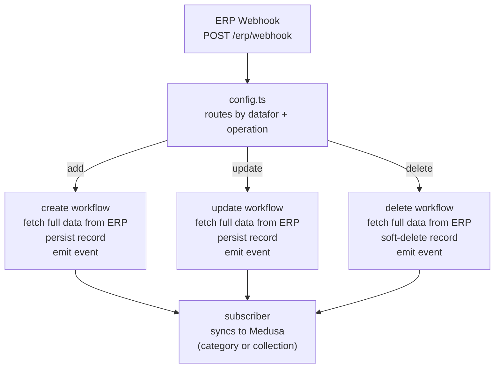

# Categories & Collections CRUD

Syncs five ERP master entities — collection groups, collection items, category groups, categories, and sub-categories — into Medusa's product category and collection trees.

---

## Overview

These five masters form two parallel hierarchies that arrive from the ERP via webhook. Each entity is stored locally in its own module, then mirrored into Medusa (as a product category or collection) so that storefront navigation, product tagging, and search reflect the ERP's catalogue structure.

| Master             | ERP `datafor`      | Medusa target                    | Parent in hierarchy |
| ------------------ | ------------------ | -------------------------------- | ------------------- |
| CollectionGroupMst | CollectionGroupMst | Product category                 | — (root)            |
| CollectionMst      | CollectionMst      | Collection **or** Category\*     | CollectionGroupMst  |
| CategoryGroupMst   | CategoryGroupMst   | Product category                 | — (root)            |
| CategoryMst        | CategoryMst        | Product category (child)         | CategoryGroupMst    |
| SubCategoryMst     | SubCategoryMst     | Product category (child) + alias | CategoryMst         |

\* CollectionMst creates a Medusa **collection** when its `collection_group_name` is `"collection"`; otherwise it creates a product category. This lets the same ERP master feed either navigation rail depending on group type.

All operations (add / update / delete) enter through the ERP webhook at `/erp/webhook`. The `data` field is always a flat array of ERP IDs (strings). The workflow fetches the full record from the ERP service for each ID, so the webhook payload itself carries no field data — only identifiers.

```json
{ "datafor": "CategoryMst", "operation": "add", "data": ["17", "18", "19"] }
```

Events are queued as `erp_event` rows and processed by a cron job that dispatches each to the correct workflow.

---

## The Flow



The create step filters out any records where `IsBlockForUse = true` before persisting. Blocked items are silently ignored.

---

## CollectionGroupMst

No event is emitted. Medusa sync happens inline inside a workflow step — there is no subscriber for this master.

### Create

**Step 1 — Persist.**
We create `collection_group_master` records from the ERP payload. Fields stored: `collection_group_no`, `collection_group_code`, `collection_group_name`.

**Step 2 — Inline sync.**
`createCategoryStep` runs immediately after persist. For each record where `collection_group_name.toLowerCase() !== "collection"`, it calls Medusa's `createProductCategoriesWorkflow` directly and writes the returned category ID back to `mapping_id`. Records whose group name is `"collection"` are skipped here — they are handled by CollectionMst.

### Update

We look up the existing record by `collection_group_no` and patch the name and code fields. No Medusa sync is triggered on update (marked TODO in the workflow).

### Delete

We soft-delete by ID. No Medusa category cleanup is triggered on delete (no subscriber, no inline compensation step).

### Example Payloads

**Create** — `"1"` (HEARTBEAT) has `IsBlockForUse: true` so it is silently dropped after fetch; only `"19"` (Occasion) is persisted and synced.

```json
{ "datafor": "CollectionGroupMst", "operation": "add", "data": ["1", "19"] }
```

**Update** — the ERP resends `"21"` (Collection) with updated fields.

```json
{ "datafor": "CollectionGroupMst", "operation": "update", "data": ["21"] }
```

**Delete** — removes `"22"` (Gifts) and its Medusa product category.

```json
{ "datafor": "CollectionGroupMst", "operation": "delete", "data": ["22"] }
```

---

## CollectionMst

**Event emitted:** `collection_master`
**Subscriber:** `src/subscribers/collection-master.ts`

### Create

**Step 1 — Persist.**
We create `collection_master` records. Each record stores `collection_no`, `collection_code`, `collection_name`, plus a denormalised copy of its parent's group code and name.

**Step 2 — Route to Medusa by group type.**
We split the batch:

```
collection_group_name.toLowerCase() === "collection"
├─ YES → emits `collection_master` { operation: "create" } → subscriber creates a Medusa collection
└─ NO  → createCategoryStep (inline) creates a Medusa product category
```

The `mapping_id` on the local record is set to the Medusa collection or category ID created in this step.

### Update

Look up by `collection_no`, patch fields, then emit `collection_master` `{ operation: "update" }` filtered to items where `collection_group_name === "collection"`. The subscriber calls `updateCollectionsWorkflow` using `mapping_id`.

### Delete

Look up by `collection_no`, soft-delete, then emit `collection_master` `{ operation: "delete" }`. The subscriber calls `deleteCollectionsWorkflow` using `mapping_id`.

### Example Payloads

**Create** — `"31"` (The Maze) belongs to group `"Collection"` → Medusa **collection**. `"19"` (Engagement) belongs to group `"Occasion"` → Medusa **product category**.

```json
{ "datafor": "CollectionMst", "operation": "add", "data": ["31", "19"] }
```

**Update** — the ERP resends `"40"` (Fancy, under Theme) with a name change.

```json
{ "datafor": "CollectionMst", "operation": "update", "data": ["40"] }
```

**Delete** — removes `"99"` (Birthdays, under Gifts) and its Medusa product category.

```json
{ "datafor": "CollectionMst", "operation": "delete", "data": ["99"] }
```

---

## CategoryGroupMst

**Event emitted:** `category_group_master`
**Subscriber:** `src/subscribers/category-group-master.ts`

### Create

**Step 1 — Persist.**
We create `category_group_master` records. Fields: `grp_group_no`, `category_group_code`, `category_group_name`, `category_group_alias_name`.

**Step 2 — Emit & sync.**
The workflow emits `category_group_master` `{ operation: "create" }`. The subscriber calls `createProductCategoriesWorkflow` and writes the returned category ID back to `mapping_id`. All CategoryMst records created later use this ID as their Medusa parent.

### Update

Look up by `grp_group_no`, patch fields, emit `category_group_master` `{ operation: "update" }`. The subscriber calls `updateProductCategoriesWorkflow` using the stored `mapping_id`.

### Delete

Soft-delete by ID, emit `category_group_master` `{ operation: "delete" }`. The subscriber calls `deleteProductCategoriesWorkflow` using `mapping_id`.

### Example Payloads

**Create** — `"1016"` (Diamond Jewellery) and `"1017"` (Gold Jewellery) are created as root-level Medusa product categories.

```json
{ "datafor": "CategoryGroupMst", "operation": "add", "data": ["1016", "1017"] }
```

**Update** — the ERP resends `"1018"` (Platinum Jewellery) with an updated alias name.

```json
{ "datafor": "CategoryGroupMst", "operation": "update", "data": ["1018"] }
```

**Delete** — removes `"1021"` (Loose Diamond) and its Medusa product category.

```json
{ "datafor": "CategoryGroupMst", "operation": "delete", "data": ["1021"] }
```

---

## CategoryMst

**Event emitted:** `category_master`
**Subscriber:** `src/subscribers/category-master.ts`

### Create

**Step 1 — Persist.**
We create `category_master` records. Each record stores `grp_no`, `category_code`, `category_name`, `category_alias_name`, and a denormalised copy of its parent group's fields (`grp_group_no`, `category_group_code`, `category_group_name`).

**Step 2 — Emit & sync.**
The workflow emits `category_master` `{ operation: "create" }`. The subscriber resolves the parent CategoryGroupMst's `mapping_id` and calls `createProductCategoriesWorkflow` to create the Medusa product category as a child of that parent. The new category's Medusa ID is stored on `mapping_id`.

### Update

Look up by `grp_no`, patch fields, emit `category_master` `{ operation: "update" }`. The subscriber re-resolves the parent `mapping_id` (in case the group assignment changed) and calls `updateProductCategoriesWorkflow`.

### Delete

Soft-delete by ID, emit `category_master` `{ operation: "delete" }`. The subscriber calls `deleteProductCategoriesWorkflow` using `mapping_id`.

### Example Payloads

**Create** — `"17"` (Diamond Ring) and `"18"` (Diamond Earring) are created as children of the Diamond Jewellery Medusa category.

```json
{ "datafor": "CategoryMst", "operation": "add", "data": ["17", "18"] }
```

**Update** — the ERP resends `"45"` (Diamond, under Loose Diamond) with an updated alias name.

```json
{ "datafor": "CategoryMst", "operation": "update", "data": ["45"] }
```

**Delete** — removes `"12"` (GOLD COIN) and its Medusa product category.

```json
{ "datafor": "CategoryMst", "operation": "delete", "data": ["12"] }
```

---

## SubCategoryMst

**Event emitted:** `sub_category_master`
**Subscriber:** `src/subscribers/sub-category-master.ts`

SubCategoryMst is the only master that creates **two** Medusa entries per record.

### Create

**Step 1 — Persist.**
We create `sub_category_master` records. Fields: `sub_item_no`, `sub_category_code`, `sub_category_name`, `sub_category_alias_name`, `grp_no`, plus denormalised parent category fields.

**Step 2 — Create alias category (inline).**
`createCategoryStep` runs immediately after persist to create an alias product category. This category is used for navigation header grouping and its Medusa ID is stored in `sub_category_alias_mapping_id`.

**Step 3 — Emit & sync (main category).**
The workflow emits `sub_category_master` `{ operation: "create" }`. The subscriber resolves the parent CategoryMst's `mapping_id` (by `category_code`) and calls `createProductCategoriesWorkflow` to create the main product category as a child of that parent. Its ID is stored in `mapping_id` on the local record.

The two Medusa IDs serve different purposes: `mapping_id` is used to tag products, while `sub_category_alias_mapping_id` drives navigation header display.

### Update

Look up by `sub_item_no`, patch fields, emit `sub_category_master` `{ operation: "update" }`. The subscriber re-resolves the parent CategoryMst's `mapping_id` (by `grp_no`) and calls `updateProductCategoriesWorkflow` on `mapping_id` only. The alias category (`sub_category_alias_mapping_id`) is not updated by the subscriber.

### Delete

Soft-delete by ID, emit `sub_category_master` `{ operation: "delete" }`. The subscriber calls `deleteProductCategoriesWorkflow` using `mapping_id`. The alias category (`sub_category_alias_mapping_id`) must be cleaned up separately.

### Example Payloads

**Create** — `"1074"` (SubCategoryName: `"Bands"`, SubCategoryAliasName: `"Rings"`) illustrates the dual mapping: the alias category is created with name `"Rings"` (for navigation), the main category with name `"Bands"` (for product tagging).

```json
{ "datafor": "SubCategoryMst", "operation": "add", "data": ["1074", "1088"] }
```

**Update** — the ERP resends `"1097"` (Alphabet Necklace, alias Necklaces). Both Medusa entries are patched.

```json
{ "datafor": "SubCategoryMst", "operation": "update", "data": ["1097"] }
```

**Delete** — removes `"1184"` (Diamond, under Loose Diamond) and both its Medusa entries. If Medusa cleanup fails, `restoreSubCategoryMasters()` restores the local record.

```json
{ "datafor": "SubCategoryMst", "operation": "delete", "data": ["1184"] }
```

---

## Events / Hooks

| Master             | Event name              | Operations            | Subscriber file                        | Sync mechanism                                                       |
| ------------------ | ----------------------- | --------------------- | -------------------------------------- | -------------------------------------------------------------------- |
| CollectionGroupMst | — (none)                | add                   | — (no subscriber)                      | `createCategoryStep` runs inline in workflow                         |
| CollectionMst      | `collection_master`     | add / update / delete | `subscribers/collection-master.ts`     | `create/update/deleteCollectionsWorkflow`                            |
| CategoryGroupMst   | `category_group_master` | add / update / delete | `subscribers/category-group-master.ts` | `create/update/deleteProductCategoriesWorkflow`                      |
| CategoryMst        | `category_master`       | add / update / delete | `subscribers/category-master.ts`       | `create/update/deleteProductCategoriesWorkflow`                      |
| SubCategoryMst     | `sub_category_master`   | add / update / delete | `subscribers/sub-category-master.ts`   | `create/update/deleteProductCategoriesWorkflow` (main category only) |

**Notes:**

- CollectionGroupMst has no event and no subscriber. Medusa sync is handled directly inside `createCategoryStep` (add only). Update and delete do not sync to Medusa.
- CollectionMst emits `collection_master` only for records where `collection_group_name === "collection"`. Non-collection items are synced inline via `createCategoryStep` on add; update and delete of those items go through the event but the subscriber will have no `mapping_id` to act on if the item was never a collection.
- SubCategoryMst alias category (`sub_category_alias_mapping_id`) is created inline via `createCategoryStep` before the event fires. It is not updated or deleted by the subscriber.

---

## Key Mechanisms

### mapping_id as the Medusa bridge

Every master record stores a `mapping_id` that is the Medusa ID (category ID or collection ID) created during the first successful sync. All subsequent updates and deletes use this stored ID to target the correct Medusa record. We never re-query Medusa by name; we always go through `mapping_id`.

### Hierarchy enforcement

The subscriber pattern ensures parent `mapping_id` values are resolved at sync time rather than baked in at persist time. This means a CategoryMst subscriber reads the current `mapping_id` from the parent CategoryGroupMst row, so if the parent's Medusa category was recreated for any reason, the child picks up the latest ID automatically on its next update.

### IsBlockForUse filtering

Items marked `IsBlockForUse = true` by the ERP are filtered out before any persist step. Blocked items generate no Medusa entities and are not stored locally. If a previously active item is later sent as blocked in an update payload, the update step processes only the non-blocked items in the batch; the blocked item must be removed via a separate delete operation.

### Denormalised parent fields

CollectionMst, CategoryMst, and SubCategoryMst each store a copy of their parent's code and name alongside their own fields. This avoids join queries when returning master data via the admin API, but means a parent rename does not automatically propagate to child records — the ERP is expected to resend child records when a parent changes.

---

## After a Successful Operation

On **create**: the master record exists locally, a Medusa category (or collection) has been created, and `mapping_id` is populated. SubCategoryMst also populates `sub_category_alias_mapping_id`.

On **update**: the local record reflects the latest ERP fields, and the Medusa category/collection title and metadata are updated in place.

On **delete**: the local record is soft-deleted and the linked Medusa category/collection is removed. SubCategoryMst deletes both Medusa entries.

---

## Edge Cases

- **CollectionMst group type split**: the routing between Medusa collection and product category is determined at create time by the `collection_group_name` value. A subsequent update that changes the group name will update the existing Medusa entity in place, not swap its type. Changing from category-type to collection-type (or vice versa) requires a delete + re-add cycle from the ERP.
- **Blocked items in batch**: if a batch contains a mix of active and blocked items, we persist the active ones and silently skip the blocked ones. No error is raised for blocked items.
- **Parent not yet synced**: if a CategoryMst arrives before its parent CategoryGroupMst has been processed, the subscriber will find no `mapping_id` on the parent and the Medusa create will fail. Events are processed in arrival order; the ERP is expected to send parents before children.
- **Alias category on SubCategoryMst**: the alias category is created in a separate `createCategoryStep` call before the main event is emitted. If the alias step succeeds but the main subscriber fails, the alias category will exist in Medusa without a corresponding main category. Re-running the workflow will attempt to create a second alias; deduplication relies on the ERP sending a clean retry.

---

## End-to-End: Creating the Diamond Ring Hierarchy

This traces the complete sync for a Diamond Ring product from a fresh state — five webhook calls, each building on the last. The collection side (The Maze) and the category side (Diamond Ring > Bands) are independent trees that both land on the same product.

### Step 1 — Create the collection group

```json
{ "datafor": "CollectionGroupMst", "operation": "add", "data": ["21"] }
```

ERP record fetched: `{ CollectionGroupNo: 21, CollectionGroupCode: "CO", CollectionGroupName: "Collection", IsBlockForUse: false }`

The workflow persists the `collection_group_master` row. The subscriber creates a Medusa product category named `"Collection"` and writes the returned ID back:

```
collection_group_master row 21
└─ mapping_id = "pcat_CO_xxxx"
```

### Step 2 — Create the collection item

```json
{ "datafor": "CollectionMst", "operation": "add", "data": ["31"] }
```

ERP record fetched: `{ CollectionNo: 31, CollectionCode: "TM", CollectionName: "The Maze", CollectionGroupNo: 21, CollectionGroupName: "Collection", IsBlockForUse: false }`

`CollectionGroupName.toLowerCase() === "collection"` is `true`, so the subscriber creates a **Medusa collection** (not a product category):

```
collection_master row 31
└─ mapping_id = "col_TM_xxxx"   ← Medusa collection ID
```

### Step 3 — Create the category group

```json
{ "datafor": "CategoryGroupMst", "operation": "add", "data": ["1016"] }
```

ERP record fetched: `{ GrpGroupNo: 1016, CategoryGroupCode: "DJ", CategoryGroupName: "Diamond Jewellery", IsBlockForUse: false }`

Subscriber creates a root-level Medusa product category:

```
category_group_master row 1016
└─ mapping_id = "pcat_DJ_xxxx"
```

### Step 4 — Create the category

```json
{ "datafor": "CategoryMst", "operation": "add", "data": ["17"] }
```

ERP record fetched: `{ GrpNo: 17, CategoryCode: "DRG", CategoryName: "Diamond Ring", GrpGroupNo: 1016, IsBlockForUse: false }`

The subscriber reads `mapping_id` from `category_group_master` row 1016 and creates a Medusa product category as a child of `pcat_DJ_xxxx`:

```
category_master row 17
└─ mapping_id = "pcat_DRG_xxxx"   ← child of pcat_DJ_xxxx
```

### Step 5 — Create the sub-category

```json
{ "datafor": "SubCategoryMst", "operation": "add", "data": ["1074"] }
```

ERP record fetched: `{ SubItmNo: 1074, SubCategoryCode: "DRB", SubCategoryName: "Bands", SubCategoryAliasName: "Rings", GrpNo: 17, CategoryCode: "DRG", IsBlockForUse: false }`

Two Medusa entries are created:

1. `createCategoryStep` creates an alias category named `"Rings"` → stored in `sub_category_alias_mapping_id` (used by the navigation header to group under "Rings")
2. The subscriber reads `mapping_id` from `category_master` row 17 and creates the main category named `"Bands"` as a child of `pcat_DRG_xxxx` → stored in `mapping_id` (used to tag products)

```
sub_category_master row 1074
├─ mapping_id                  = "pcat_Bands_xxxx"   ← child of pcat_DRG_xxxx, tags products
└─ sub_category_alias_mapping_id = "pcat_Rings_xxxx" ← alias, drives navigation header
```

### Final Medusa State

```
[Product Category Tree]

Diamond Jewellery  (pcat_DJ_xxxx)
└── Diamond Ring  (pcat_DRG_xxxx)
└── Bands   (pcat_Bands_xxxx)   ← product tagging

Rings  (pcat_Rings_xxxx)                ← navigation header alias

[Collection]

The Maze  (col_TM_xxxx)                 ← Medusa collection, assigned to products
```

A product in the "Bands" sub-category of "Diamond Ring" jewellery, belonging to "The Maze" collection, is tagged with `pcat_Bands_xxxx` and assigned to collection `col_TM_xxxx`. The storefront navigation header uses `pcat_Rings_xxxx` to surface the item under "Rings".
