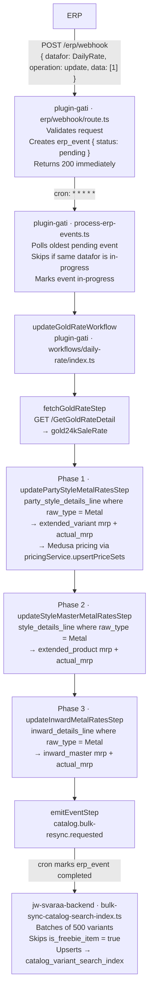
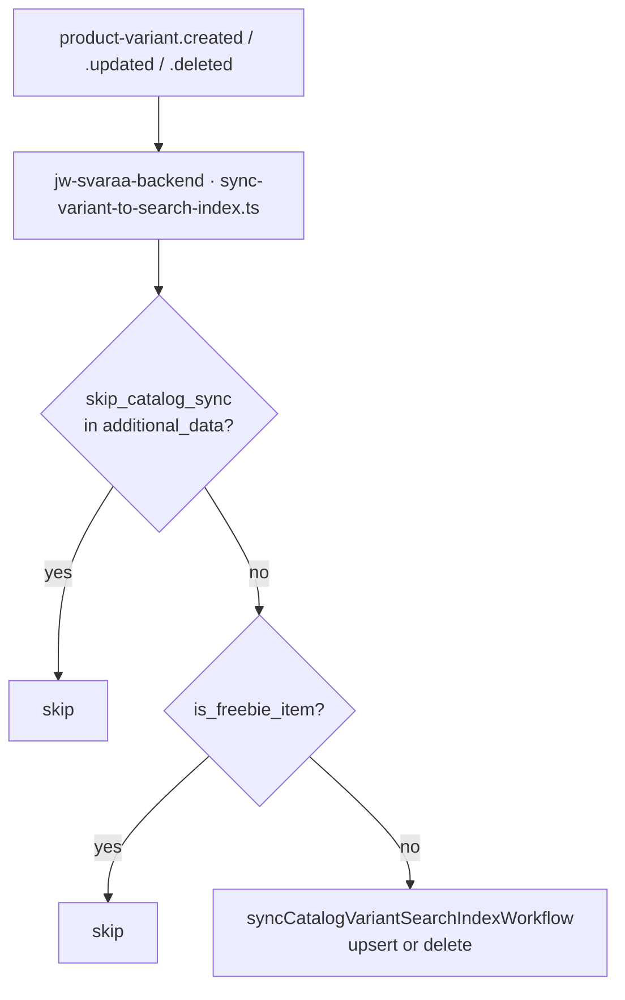

# Daily Rate Update Workflow

When the ERP sends a `DailyRate` webhook, we recalculate and persist updated gold rates across every open metal line in the system — party styles, style master, and inward — without pulling data from the ERP. After the rate update completes, the catalog search index is fully rebuilt.

---

## Overview

The ERP sends a single webhook when the gold rate changes. We do not receive per-item rates; we receive the new `gold24kSaleRate` and derive everything ourselves using quality clarity percentages stored locally.

**What changes:** sale-side rates and amounts (`original_rate`, `rate`, `actual_amount`, `amount`, `final_amt`) on every Metal line, plus the rolled-up `mrp` and `actual_mrp` on their parent records, and Medusa variant prices.

**What never changes:** cost fields (`cost_rate`, `original_cost_rate`, `cost_amount`). Cost is not driven by the daily gold rate.

| Trigger     | Payload                                                                                                                            |
| ----------- | ---------------------------------------------------------------------------------------------------------------------------------- |
| ERP webhook | `{ datafor: "DailyRate", operation: "update", data: ["1"] }`                                                                       |
| Entry point | `updateGoldRateWorkflow` (plugin-gati)                                                                                             |
| Steps       | fetch-gold-rate-step → update-party-style-metal-rates-step → update-style-master-metal-rates-step → update-inward-metal-rates-step |

The workflow is idempotent: re-running with the same gold rate produces the same result (all deltas are zero after the first run).

---

## Full Flow



---

### Separate: Per-Variant Sync (non-daily-rate changes)



This subscriber handles catalog index updates for all variant and product changes outside of the daily rate update (e.g. stock changes, metadata edits, product status changes). The daily rate update bypasses `product-variant.updated` entirely and triggers a full bulk resync directly from the workflow.

---

## Rate & Amount Calculation

For each line where `raw_type = "Metal"`:

```
rate    = round( gold24kSaleRate × qly_clarity / 100 )
amount  = round( weight × rate )
```

All five line fields resolve to the same derived value: `original_rate = rate`, `actual_amount = amount`, `final_amt = amount`.

Metal lines never carry a discount or markup. Discounts apply only to diamond, gemstone, and making-charge (CPF) lines — those are untouched by this workflow.

`qly_clarity` comes from the `quality_master` table keyed by `qly_code`. Lines with no matching quality entry are skipped silently.

> `qly_clarity` (not `qly_mfg_clarity`) is used for sale-side calculations.

---

## mrp Update — Delta-Based

The `mrp` on parent records (`extended_variant`, `extended_product`, `inward_master`) is updated using a **delta**, not a full recomputation from components:

```
mrpDelta        = Σ (new amount      − old amount)      across all Metal lines
actualMrpDelta  = Σ (new actual_amount − old actual_amount)

new mrp         = old mrp + mrpDelta
new actual_mrp  = old actual_mrp + actualMrpDelta
```

This approach is robust: diamond, stone, and CPF component totals stored on the parent record are **not touched**. Only the metal component's change is propagated. If diamond discounts or CPF amounts are stale from a prior sync, they remain untouched and correct — the daily rate workflow only adjusts the metal portion.

---

## Fields Updated — by Table

### `party_style_details_line` / `style_details_line` / `inward_details_line`

_(only rows where `raw_type = "Metal"`)_

| Field           | New value                                      |
| --------------- | ---------------------------------------------- |
| `rate`          | `round( gold24kSaleRate × qly_clarity / 100 )` |
| `original_rate` | same as `rate`                                 |
| `amount`        | `round( weight × rate )`                       |
| `actual_amount` | same as `amount`                               |
| `final_amt`     | same as `amount`                               |

**Not touched:** `cost_rate`, `original_cost_rate`, `cost_amount`, `hand_*`, `set_*`, `loss_*`, `cpf_*` fields.

---

### `extended_variant` (Phase 1 parent)

| Field                       | New value                                          |
| --------------------------- | -------------------------------------------------- |
| `metal_total_amount`        | Σ new `amount` for all Metal lines of this variant |
| `actual_metal_total_amount` | Σ new `actual_amount`                              |
| `mrp`                       | `old mrp + mrpDelta`                               |
| `actual_mrp`                | `old actual_mrp + actualMrpDelta`                  |
| `actual_total_amount`       | `old actual_total_amount + actualMrpDelta`         |

After updating `extended_variant`, Phase 1 also pushes the new `mrp` to the Medusa product variant pricing table. It does this by resolving `price_set.id` for each variant via `remoteQuery.graph`, then calling `pricingService.upsertPriceSets()` directly — one call per outer batch of 1,000. Only variants where `mapping_id` is set and `deleted_at IS NULL` are included.

This bypasses `updateProductVariantsWorkflow` intentionally: the full workflow emits a `product-variant.updated` event per variant and carries inventory/hook overhead that is unnecessary for a price-only update.

---

### `extended_product` (Phase 2 parent)

| Field                | New value                                        |
| -------------------- | ------------------------------------------------ |
| `metal_total_amount` | Σ new `amount` for all Metal lines of this style |
| `mrp`                | `old mrp + mrpDelta`                             |
| `actual_mrp`         | `old actual_mrp + actualMrpDelta`                |

No product variant price sync for style master.

---

### `inward_master` (Phase 3 parent)

| Field        | New value                         |
| ------------ | --------------------------------- |
| `mrp`        | `old mrp + mrpDelta`              |
| `actual_mrp` | `old actual_mrp + actualMrpDelta` |

`inward_master` has no `metal_total_amount` field — it is not updated.

---

## Compensation & Rollback

Each step stores a snapshot of affected rows **before** writing. If a later step fails, Medusa's workflow engine calls the compensation function of each completed step in reverse order.

Stored per step:

- **Phase 1:** `lines[]` + `variants[]` (including `mapping_id` for price revert)
- **Phase 2:** `lines[]` + `products[]`
- **Phase 3:** `lines[]` + `inwards[]`

On rollback: restore all snapshotted fields. Phase 1 additionally reverts Medusa prices by calling `pricingService.upsertPriceSets()` with the snapshotted `mrp` values, using the same direct approach as the forward path.

---

## ERP Event Queue

The webhook does not trigger processing synchronously. The route handler writes to `erp_event` and returns immediately. The `process-erp-events` cron (every minute) picks up pending events FIFO, with one constraint: if an event of the same `datafor` type is already `in-progress`, all other events of that type are skipped until it completes. This prevents concurrent processing of the same data type.

States: `pending` → `in-progress` → `completed` / `failed`

---

## Edge Cases / Known Gaps

- **Diamond / stone / CPF lines**: Lines with `raw_type != "Metal"` are skipped entirely. Those amounts are not recalculated during a gold rate update.
- **Delta divergence between `mrp` and `actual_mrp`**: Expected. `mrp` uses post-markup amounts; `actual_mrp` uses pre-markup amounts. If `dis_markup_per` differs across lines, the two deltas diverge — that is correct behaviour.
- **Quality master must be populated**: A missing `qly_code` entry silently skips that line, leaving it with stale rates.
- **All inward records processed**: Phase 3 processes inward records regardless of their status (Inward, Sold, etc.).
- **Freebie variants excluded from catalog index**: Variants where `is_freebie_item = true` are skipped in both the bulk resync and the per-variant sync. The `catalog_variant_search_index` will always have fewer records than `product_variant` by the number of freebie variants.
