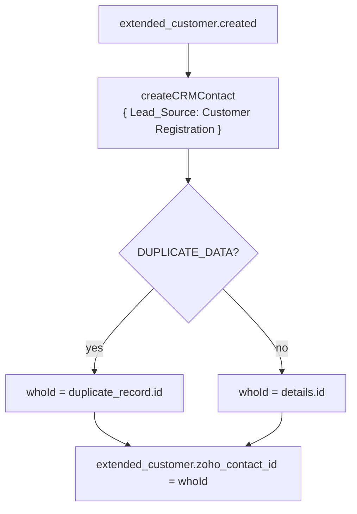
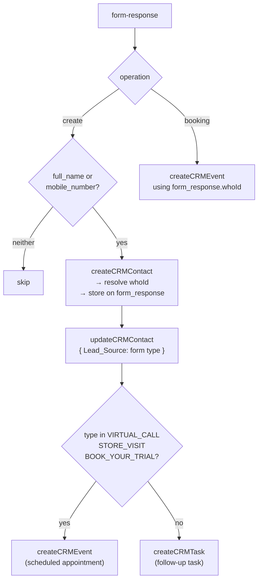
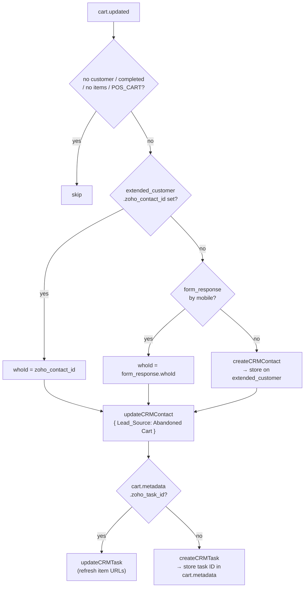
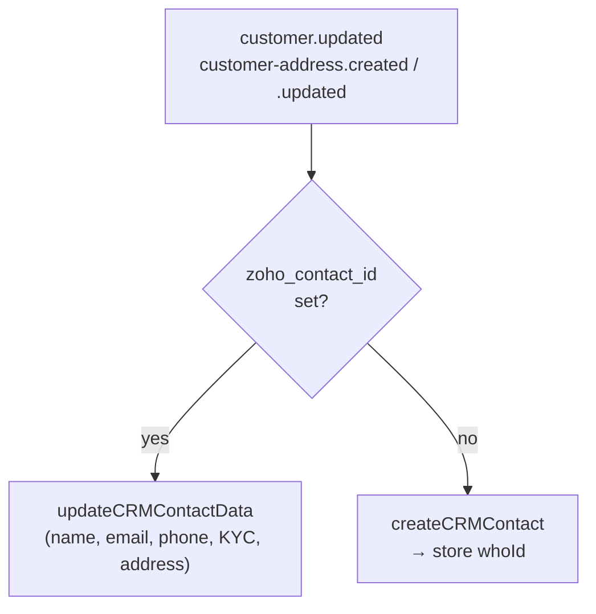

# Zoho CRM Integration

Syncs customer touchpoints to Zoho CRM as contacts, tasks, and calendar events.

| Touchpoint         | Medusa event                                            | Zoho action                                                                     |
| ------------------ | ------------------------------------------------------- | ------------------------------------------------------------------------------- |
| Customer registers | `extended_customer.created`                             | Create contact, set `Lead_Source: Customer Registration`                        |
| Form submitted     | `form-response`                                         | Create/find contact → update `Lead_Source` → task/event                         |
| Cart abandoned     | `cart.updated`                                          | Create/find contact → update `Lead_Source: Abandoned Cart` → create/update task |
| Profile updated    | `customer.updated`                                      | Update contact fields (name, email, phone, KYC)                                 |
| Address changed    | `customer-address.created` / `customer-address.updated` | Update mailing address fields on contact                                        |

---

## Flows

### Registration

### Form Submission

### Abandoned Cart

### Profile / Address Update

---

## Key Points

- **`zoho_contact_id`** on `extended_customer` — anchor for all Zoho writes; resolved once, reused forever.
- **`Lead_Source`** reflects the latest touchpoint; always overwritten on each action.
- **`updateCRMContact`** (Lead_Source only) and **`updateCRMContactData`** (profile fields only) are kept separate so profile edits don't overwrite the lead source.
- **DUPLICATE_DATA**: Zoho returns this when a contact already exists by email/mobile. Use `duplicate_record.id` as `whoId`.
- **Token**: single in-memory OAuth2 token, refreshed if last refresh was >2 min ago. Cleared on server restart.
